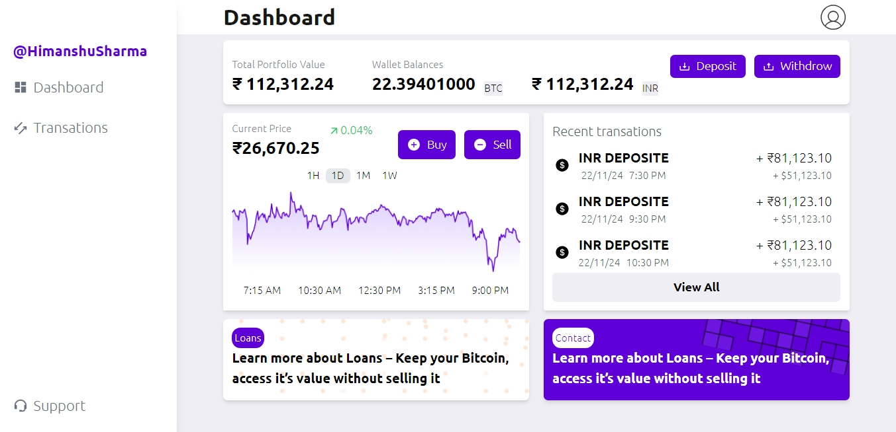

# Crypto Dashboard

This is a Crypto Dashboard project built using React and Tailwind CSS. It allows users to track cryptocurrency prices, view charts, and monitor their favorite cryptocurrencies.

## Features
- Interactive charts for price history
- Responsive design for mobile and desktop devices

## Technologies Used

- React
- Tailwind CSS

## Installation

1. Clone the repository:

  
   git clone https://github.com/your-username/crypto-dashboard.git
   

2. Navigate to the project directory:

   
   cd crypto-dashboard
   

3. Install dependencies:

   npm install
   

4. Start the development server:

 
   npm start
   

5. Open your browser and visit `http://localhost:3000` to view the app.

## Usage

- Navigate to the homepage to view the list of cryptocurrencies.
- Use the search bar to find specific cryptocurrencies.
- Click on a cryptocurrency to view its details and price chart.
- Add cryptocurrencies to your favorites list for quick access.

## Contributing

Contributions are welcome! If you find any issues or have suggestions for improvement, please open an issue or create a pull request.

